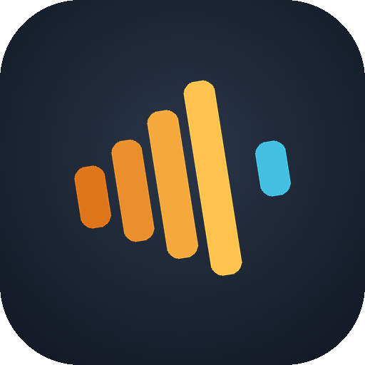
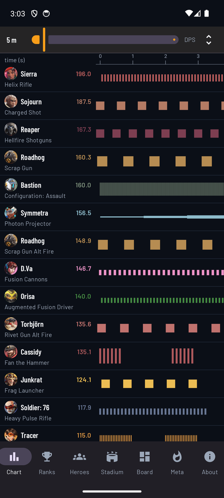
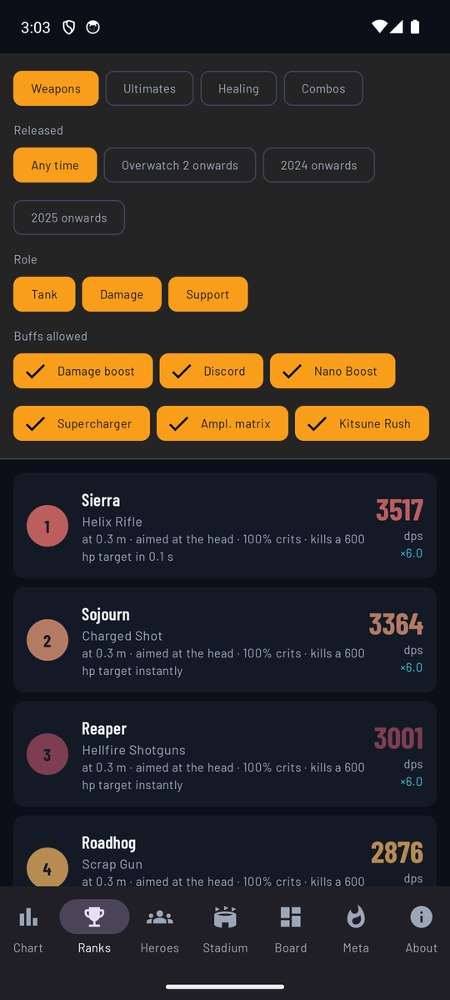
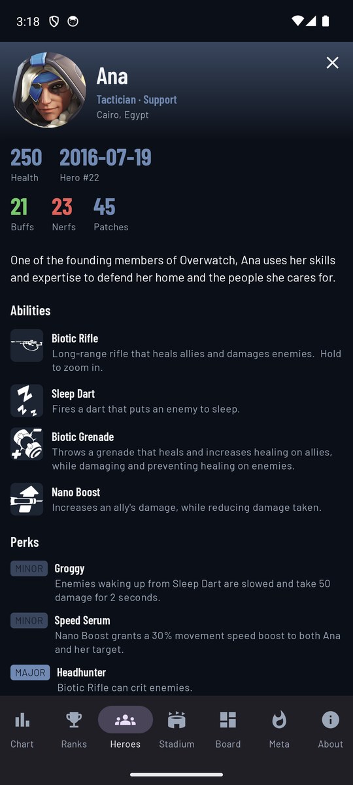
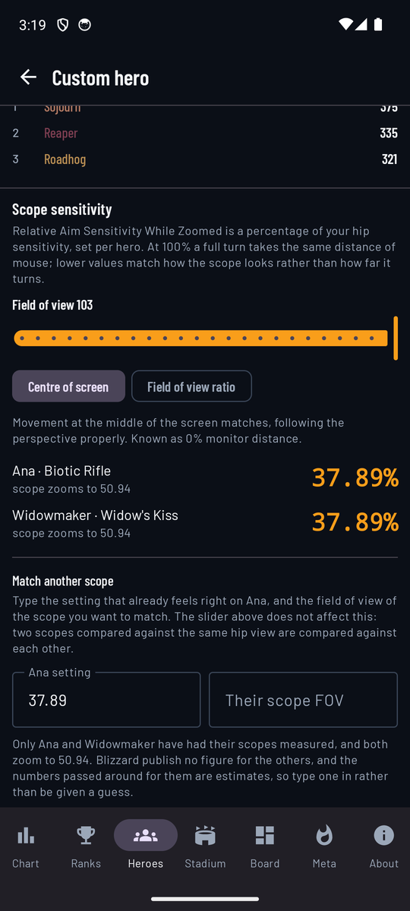
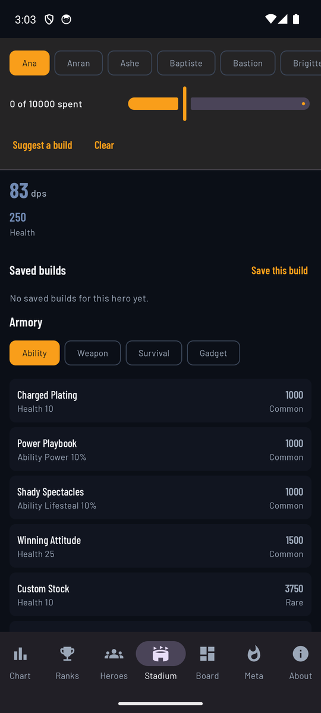
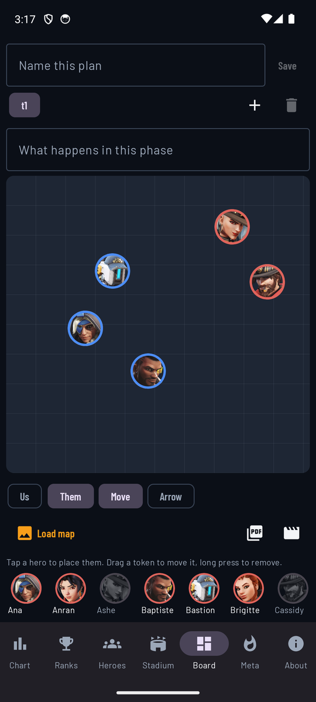
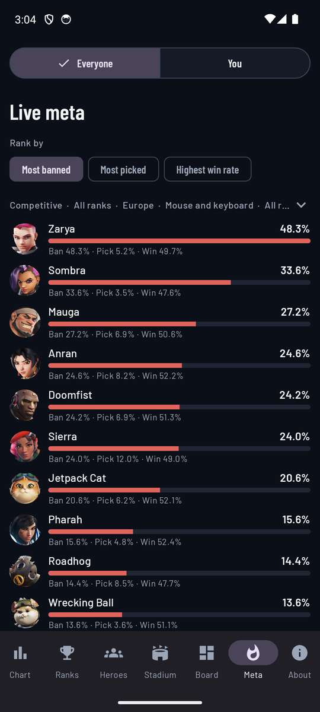

# OW Companion

Android app that pairs an interactive **damage chart** — a port of
[owdmgchart](https://yfp.github.io/owdmgchart/public/index.html) rebuilt natively for touch —
with a **hero wiki** covering portraits, abilities, release dates and the full balance
history of every hero.

Status: **working, and looking for opinions.** All 52 heroes, 129 weapons, ten years of
balance history, 1268 match-ups, and the live meta, in 16 languages. If you play Overwatch and something here looks wrong,
please [open an issue](../../issues) — see [CONTRIBUTING.md](CONTRIBUTING.md) for the parts
we already know are weak.

## Why not just look it up

Most of what is here can be found somewhere on the internet, in about six places. The wiki
has the raw numbers, Blizzard publish pick rates, the patch notes are archived, and there
are sites for match-ups and for career stats. Using them together means six tabs, and every
one of them answers a slightly different question from the one you asked.

The gap is that **none of them will compare two weapons for you**. The wiki will tell you
that Cassidy's Peacekeeper does 70 damage a shot at two shots a second, and that Soldier's
rifle does 19 at nine. It will not tell you which of them is actually better at fifteen
metres against an armoured target — that depends on falloff, spread, reload, travel time and
where the crosshair sits, and answering it means running the shots. This app runs them, for
every weapon at once, and sorts the result.

The rest is a consequence of having done that:

- **One ranking instead of 52 pages.** The wiki is organised per hero, so "who has the
  highest sustained DPS" is not a question it can answer. Here it is a sort.
- **Balance history as a shape.** Ten years of patch notes are prose you would have to read
  in order. The same changes are drawn as a line, so a nerf is something you see.
- **The comparison that only exists here.** Damage, healing and ultimates are ranked
  separately, because they are three different questions and mixing them produces nonsense.
- **It works on the underground.** Everything is in the app; the network is only used for
  live pick rates and career lookups, both optional.
- **No account, no ads, no tracking**, and nothing is sent anywhere.

What it is not: a replacement for the wiki's prose, for the official patch notes, or for
match history. It is the calculator those sources do not include — and it credits every one
of them.

### Download

**[Download the latest APK](../../releases/latest)** — Android 8.0 or newer, about 29 MB.

It is a debug build signed with the standard Android debug key, so your phone will warn you
that it comes from an unknown source; that is expected for an app that does not go through
the Play Store. Nothing is collected, and everything works offline.

### What it looks like

| Damage chart | Rankings | Hero |
|---|---|---|
|  |  |  |
| Every shot drawn as a rectangle whose **area** is its damage | Weapons, ultimates and healing ranked separately | Abilities, perks, and how a hero's damage moved over ten years |

| Custom hero | Stadium | Board |
|---|---|---|
|  |  |  |
| Move a weapon's numbers and see where it lands — and the scope sensitivity calculator | Pick items and watch the hero's stats move | Place both teams, draw the plan, export it |

| Live meta |
|---|
|  |
| Ban, pick and win rates from Blizzard, by rank, region, map and role |

## Screens

- **Chart** — every weapon's firing sequence over time, driven by distance, aim point and
  modifiers.
- **Ranks** — three rankings, because they are three different questions: sustained damage
  per second for weapons, damage per cast for ultimates, healing per second for healers.
- **Heroes** — portraits, abilities, perks, release dates, and every balance change since
  2016 with a chart of how a hero's damage moved over the years. At the end of the roster
  is a hero who does not exist:
  - **Custom hero** — what if Roadhog reloaded a third of a second faster? Move a real
    weapon's numbers and see where it lands in the real ranking. It also holds the **scope
    sensitivity calculator**: Relative Aim Sensitivity While Zoomed is set per hero and the
    game gives no way to carry a setting from one scope to another, so this works it out.
- **Stadium** — the Armory: pick items by hand and watch the hero's stats move, or let the
  optimiser propose a build for a budget and show what each item was worth.
- **Board** — a whiteboard for briefings: place both teams, draw arrows, step through
  phases, and export the result as a PDF or a video to send to the group chat.
- **Meta** — Blizzard's own ban, pick and win rates, filtered by rank, region, map, input
  and role, plus any public career looked up by BattleTag.

## Why the numbers should be believed

The simulation is an independent Kotlin port of
[owdmgchart](https://github.com/yfp/owdmgchart). It is held to the original by running that
JavaScript headlessly and asserting agreement across 46 weapons and 11 distance, aim and
modifier configurations — exactly, for everything the random number generator does not
touch, and within six standard errors for what it does.

The weapon data is parsed from the Overwatch Wiki. Anything the parser could not read with
confidence is **held out of the app entirely** and listed in `dataset/review.md` rather than
guessed at. Healing weapons are excluded from the damage chart for dealing no damage;
ultimates that deal no damage are named as excluded rather than ranked at zero.

Where a figure is uncertain, the app says so on the screen showing it.

## Languages

The interface is in English, Italian, Spanish, Portuguese, French, German, Polish, Swedish,
Turkish, Russian, Ukrainian, Arabic, Japanese, Korean and Chinese (simplified and
traditional). It follows the phone's language by default; there is a picker with flags under
**About** to override it.

Two honest caveats: the translations are not native-reviewed, so corrections are very
welcome — and **hero, weapon and ability names stay in English**, because they come from the
English wiki that the dataset is built from. A Korean interface still says "Biotic Rifle".

## What the damage chart does

It answers "how much damage does this weapon *actually* do?" rather than what the tooltip
claims. For every weapon it simulates a real firing sequence against a target at a given
distance and crosshair placement, accounting for:

- damage falloff over range, and hard range cutoffs
- spread cones and per-pellet scatter for shotguns
- projectile travel time, including ballistic arcs
- ammo, reload and burst timing
- critical hits, decided by whether a sampled pellet lands on the head hitbox
- damage modifiers (armour, damage boost, discord, and friends)

The result is a mean DPS you can sort and compare across the whole roster.

## Layout

| Path | What lives there |
|---|---|
| `app/src/main/java/com/bellizia/owcompanion/sim/` | Simulation engine — pure Kotlin, no Android dependencies, unit tested on the JVM |
| `app/src/main/java/com/bellizia/owcompanion/data/` | Dataset loading, versioning, optional online refresh |
| `app/src/main/java/com/bellizia/owcompanion/ui/` | Compose UI: chart screen and hero wiki |
| `tools/js_oracle/` | Node harness that runs the original JavaScript implementation to generate golden test values |
| `tools/` | Python data pipeline that builds the hero/weapon/patch dataset |
| `dataset/` | Pipeline output plus the manual-review report |

## Building

Requires JDK 17+ and the Android SDK (platform 35). Android Studio's bundled JBR works:

```bash
JAVA_HOME="/c/Program Files/Android/Android Studio/jbr" ./gradlew assembleDebug
```

Run the engine tests:

```bash
JAVA_HOME="/c/Program Files/Android/Android Studio/jbr" ./gradlew test
```

Regenerate the golden values the engine is tested against (requires Node):

```bash
node tools/js_oracle/generate_golden.js
```

## Porting

The app is being split across five platforms — Android including TV, iPhone, a web app,
Windows and Linux. [PORTING.md](PORTING.md) is a self-contained brief for that work: what is
reusable, what has to be rebuilt, the parsing traps that have already cost real bugs, and the
licence position. Written to be read cold.

## Thanks

**BYZ** and **MrStonestar** played with this and reported what was wrong. Bastion stuck in
Recon mode, Ashe reloading twelve rounds in half a second, Symmetra's and Torbjörn's turrets
missing from the chart entirely, quick melee appearing to do no damage at all — each of those
was a real defect found by someone using the app rather than building it. Several numbers in
here are right because they said so.

## Attribution and licensing

This is a non-commercial fan project.

- The simulation model and the 2020 reference dataset derive from
  [yfp/owdmgchart](https://github.com/yfp/owdmgchart), MIT licensed. The vendored copies
  used as a test oracle live in `tools/js_oracle/vendor/`.
- Hero statistics, balance history and match-up advice are sourced from the
  [Overwatch Wiki](https://overwatch.fandom.com), licensed CC BY-SA.
- Ban, pick and win rates are read from Blizzard'''s own
  [rates page](https://overwatch.blizzard.com/en-us/rates/) when the Meta screen is open.
  They are shown, never stored.
- Hero portraits, ability icons, names and artwork are the property of Blizzard
  Entertainment, used under Blizzard's Fan Content Policy. This project is not affiliated
  with or endorsed by Blizzard.

The launcher icon is drawn by [tools/make_icon.py](tools/make_icon.py) out of plain rounded
rectangles and two of the app's own colours. It borrows no artwork, mark or likeness from
anyone: it is a burst of fire drawn the way the damage chart draws one, four shots climbing,
the gap where the magazine runs dry, then the first shot of the next.

Application code in this repository is MIT licensed — see [LICENSE](LICENSE).
