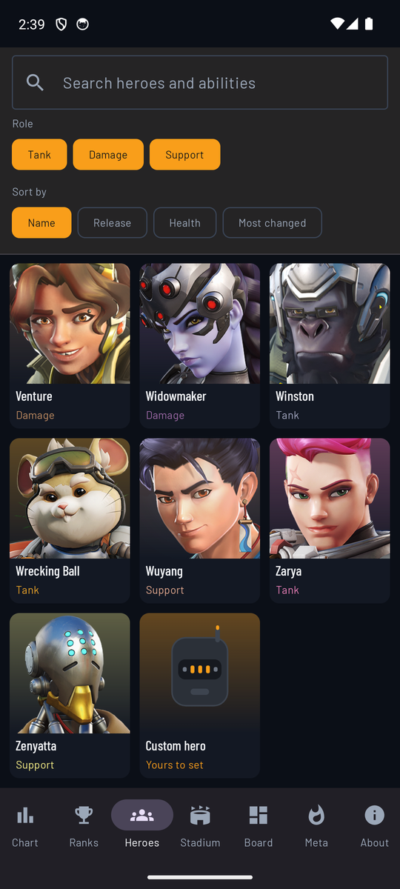
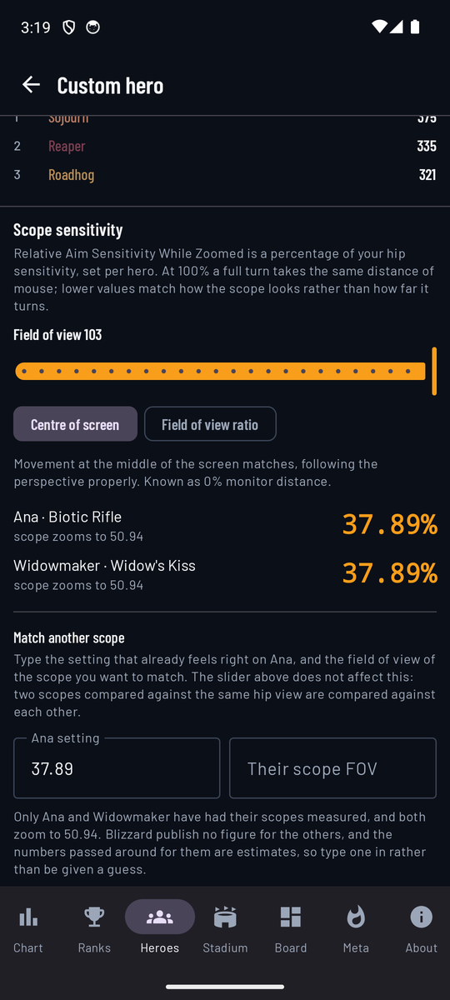
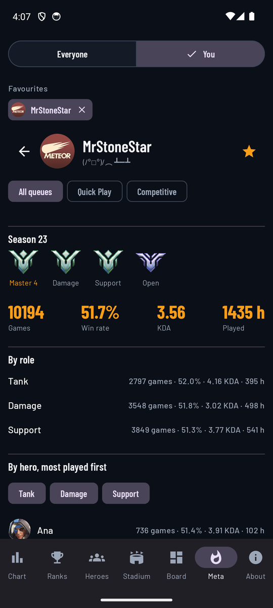
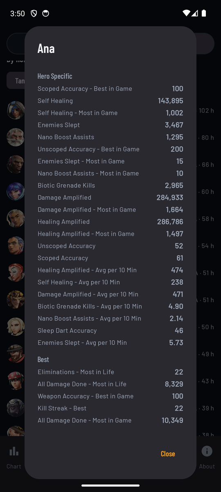

# OW Companion — how to use it

Everything in the app, screen by screen, with what each number means and where it came
from. Nothing here needs an account, and only two screens use the network at all.

The bottom bar has seven entries. There is an eighth screen, the custom hero, and it lives
at the end of the hero roster rather than in the bar.

---

## Chart

Every weapon firing at once, drawn against time. Each shot is a rectangle whose **area** is
its damage, so a shotgun's slow heavy blows and a machine pistol's fast light ones can be
compared by eye rather than by arithmetic.

The number beside each hero is the mean damage per second **including reloading**, which is
usually lower than the figure the wiki quotes.

**Distance** is the slider at the top, and it changes everything below it: falloff, travel
time, and whether a weapon reaches at all. A weapon with a hard range cutoff greys out past
it and says "out of range" rather than reporting zero.

**Aim** is set by dragging the crosshair over the target. It decides how often a pellet
lands on the head, which is what the crit column reports.

**Weapon charge** appears for the weapons that have one — Zarya's energy, for instance —
and rescales them as it would in the game.

The chevron at the top right folds the controls away, which is worth doing once you have set
them: the chart is the point.

 

### Sorting and filtering

| Sort | What it answers |
|---|---|
| DPS | Sustained damage, reload included. The default. |
| DPS, no reload | The first magazine only — what a burst actually does. |
| Accuracy | How much of the theoretical damage lands, at this distance and aim. |
| Crit accuracy | How much of it lands on the head. |
| Time to kill | How long to remove 600 hit points. |
| Hero | Alphabetical, for when you are looking for someone specific. |

**Modifiers** apply the game's own multipliers — armour, damage boost, discord, nano, and
the rest. They stack the way the game stacks them.

The filters below narrow the list by role, fire mode and weapon type. **Tapping one twice**
isolates it and hides everything else; tapping the isolated one again brings them all back.

---

## Ranks

Three separate rankings, because they are three different questions and mixing them
produces nonsense:

- **Weapons** — sustained damage per second, each weapon swept across every distance to
  find where it is at its best. The line under each says where that was and whether it was
  aimed at the head.
- **Ultimates** — damage per cast, not per second. An ultimate that deals no damage is named
  as excluded rather than ranked at zero, and one whose wiki figure is not a single-cast
  total is left out rather than compared against ones that are.
- **Healing** — healing per second. Healing ultimates are ranked separately from healing
  weapons, for the same reason.

**Buffs allowed** applies the modifiers to the sweep. They affect weapons only: an ultimate
does what it does, and damage boost does not multiply healing.

There is also a **combos** list — openings like hook, melee, shot — computed from the
abilities rather than written by hand.

 

---

## Heroes

The roster, searchable by hero **and by ability**: typing "sleep" finds Ana.

A hero's page carries the portrait, role and subrole, hit points, where they are from, the
date they arrived and their number in the roster, then every ability with the game's own
description, the perks, and the match-ups the wiki rates.

Below that is the part that took the longest: **every balance change since 2016**, grouped
by patch, with a buff or nerf badge worked out from the wording. Above the list is a chart
of how one number moved over the years — pick the ability and the stat, and the line is
drawn from the patch notes themselves.

Where the notes never restated a value, the app says so rather than drawing a line through
guesses.

 

---

## Custom hero

At the end of the roster, after Zenyatta, is a hero who does not exist. Tapping the card
opens the Lab.

Pick a real weapon and move its numbers — damage, rate of fire, magazine, reload, pellets —
and watch where it lands in the **real** ranking, with the heroes above and below it named.
What if Roadhog reloaded a third of a second faster? This answers that.

The portrait is drawn rather than borrowed. Every other face in the grid is Blizzard's; this
one stands for a hero nobody made.

 

### Scope sensitivity

At the bottom of the same screen. Overwatch sets **Relative Aim Sensitivity While Zoomed**
per hero and gives no way to carry a setting from one scope to another, so a new hero with a
scope means guessing and re-guessing.

Set your field of view with the slider and the app gives the value that makes a scope match
your hip aim, two ways:

- **Centre of screen** — movement at the middle of the screen matches, following the
  perspective properly. 37.89% on Ana and Widowmaker at 103.
- **Field of view ratio** — the plain ratio of the two views. Cruder, because a screen is
  flat, but it holds up better towards the edges. 49.46%.

Below that, **match another scope**: type the setting that already feels right on Ana and
the field of view of the scope you want to match. The slider does not affect this — two
scopes compared against the same hip view are compared against each other, so the answer
holds whatever your field of view is.

Only Ana and Widowmaker are shipped with a measured scope, both zooming to 50.94. Blizzard
publish nothing for the others and the figures passed around for Ashe are estimates, so the
screen asks for a number rather than handing over a guess.

 

---

## Stadium

The Armory. Pick items by hand and watch the hero's statistics move, or give the optimiser a
budget and let it propose a build, with what each item was worth to it.

Builds can be saved, renamed, duplicated and deleted, per hero.

 

---

## Board

A whiteboard for briefings.

Tap a hero to place them; drag to move; long press to remove. **Us** and **Them** set which
side the next token joins, and a hero already on the board goes grey in the strip — a team
cannot field the same hero twice.

**Arrow** draws movement instead of placing. **Load map** puts an image behind the grid.

Phases are the chips at the top: add one, describe what happens in it, and the board keeps a
separate arrangement for each. Export the lot as a **PDF**, or as a **video** that steps
through the phases, and send it to the group chat.

Plans are saved by name and reopened from the same row.

 

---

## Meta

Blizzard's own ban, pick and win rates, read from the page they publish them on. Nothing is
cached: these numbers describe this week's game, and a stale copy is worse than none.

Rank by most banned, most picked or highest win rate, and narrow by:

- **Queue** — competitive or quick play. Only competitive has a ban phase.
- **Rank** — all the way from Bronze to Champion. The numbers really do change.
- **Region** — Europe, the Americas, Asia, or **World**.
- **Input** — mouse and keyboard, or controller.
- **Map** — any map in rotation.
- **Role** — tank, damage or support.

**World** is not one of Blizzard's: they publish no worldwide figure, so the app fetches all
three regions and averages them. It is an unweighted mean, because no player counts are
published to weight by, and the screen says so under the filter.

 

---

## Your career

The **You** side of the Meta screen. Type a BattleTag — the whole thing, `Name#1234`, goes
straight to one profile — or a name, which returns the profiles Blizzard indexes.

There is no sign-in because there is nothing to sign in to: Blizzard publish a career
profile for anyone who has made theirs public, so a name is enough and the app never handles
a password. The other half of that bargain is that a **private profile shows nothing**, and
the fix for that is a setting in the game.

**All queues, Quick Play, Competitive.** Worth using: quick play dwarfs competitive for most
people, so a combined figure is really a quick play figure wearing a hat.

**This season's placements** are drawn with the game's own rank emblems, one per role. Tap
one and it names itself — "Master 4" — for a few seconds. A role you have not placed in is
left out rather than shown at zero, and placements are hidden under the quick play filter,
where they would have nothing to do with the numbers beside them.

Star a profile to keep it on the row at the top; opening one does not star it.

 

### One hero's full figures

The hero list shows four numbers because four fit. The profile records nearly ninety, and
**tapping a hero opens all of them**: accuracy scoped and unscoped, self healing, what each
ability did, bests, averages per ten minutes, and the match awards.

They follow the queue chosen above.

 

---

## About

Where every number came from, in whose licence, and a language picker with flags — the
interface is in sixteen languages, though hero and ability names stay in English because
that is the wiki the dataset is built from.

It also reports the dataset version and offers to check for a newer one. A new game patch
reaches the app without a new APK: the dataset is published separately and downloaded when
it is newer than the one built in.

---

## What the app will not do

It will not invent a number. Anything the parser could not read with confidence is held out
entirely and listed in `dataset/review.md` rather than guessed at, and where a figure is
uncertain the screen showing it says so.

It cannot show you a ranking as it stood at some past patch. Only fifteen of a hundred and
twenty-nine weapons have a damage history complete enough to reconstruct, so such a ranking
would silently show today's numbers for the rest.

It cannot separate arcade from quick play, split playtime between Overwatch 1 and 2, or show
a past season — Blizzard publish none of those.
